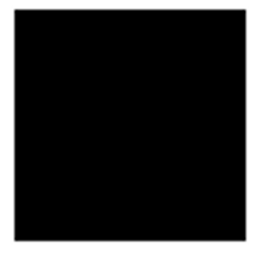
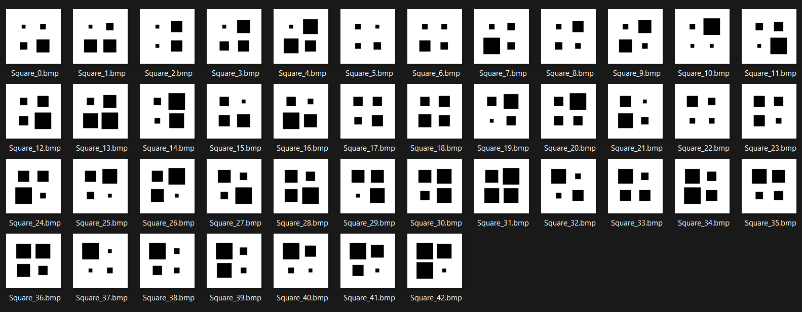

# Generated Patterns - Overview
This is a program that generates image data for computer vision classification. 

For applications in which a data set of a scalable size is needed. For example, this program will be used to generate many data sets of different sizes to evaluate neural network efficiency in process-oriented programming languages. To truly observe the efficiency, data sets of different sizes should be used. The pattern generator program allows you to generate multiple image data sets of any size in which each data set contains the same image content! 

In this repository you will find:
 * **PatternGenerator** - The program built to generate image data (code only).
 * **PatternRecognizer** - A program that utilizes a fully connected neural network to recognize the generate data (code only).
 * **PatternsForMLSpeed.pdf** - A paper describing the methodologies used in this project and results from testing the data.
 * **DataSets** - Some data sets generated by this program. These data sets are referenced in the paper.
 * **SampleImages** - Some sample images generated by the program. 

# Samples of the Generated Image Data

# Quick Summary of Method
It all begins with a **Pattern-Unit**. Pattern-Units are images depicting basic shapes and symbols that can be plotted via a programming module. The module takes at least one configurable parameter called a **scale** that controls the size of the plotted shape. Below is a sample image of a Pattern-Unit depicting a square:

Next, by generating a bunch of these units with different sizes, we can combine them into a larger image called a **Pattern**. By combining all the unique Pattern-Units in different ways, it is easy to generate large volumes of image data that is all unique and easily classifiable. Here is an example of many Patterns that were generated using different sizes of the square pattern-unit:

All you need is to tell the program what size you want your Pattern-Units and your Patterns (_and maybe a few other configurable things_) and you can get a very large image data set with all unique images!
