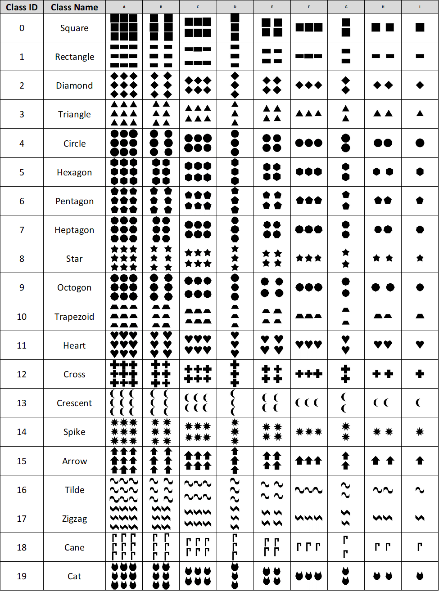

# Generated Patterns
This is a program that generates image data for computer vision classification. 

For applications in which a data set of a scalable size is needed. For example, this program will be used to generate many data sets of different sizes to evaluate neural network efficiency in process-oriented programming languages. To truly observe the efficiency, data sets of different sizes should be used. The pattern generator program allows you to generate multiple image datas set of any size in which each data set contains the same image content! 

